# turizm web sitesi
Frontend tourism website project built with HTML, CSS and JavaScript.
# Tourism Promotion Website

This project was developed as a frontend practice project.

## About the Project
The website is designed to promote tourism destinations with a simple and user-friendly interface.

## Technologies Used
- HTML
- CSS
- JavaScript

## Purpose
To improve my frontend development skills and practice basic web design principles.

## Features
- Multi-page website structure
- Navigation menu
- Interactive elements with JavaScript
## Project Structure
The website consists of 10 different pages including:
- Home
- About
- Routes
- Included
- Calculator
- Food
- Team
- FAQ
- Contacts
- Book
## Screenshots
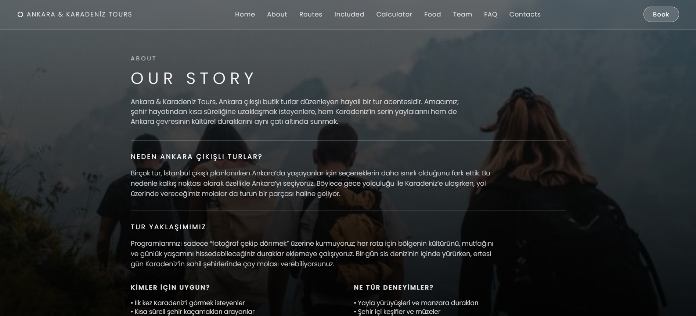
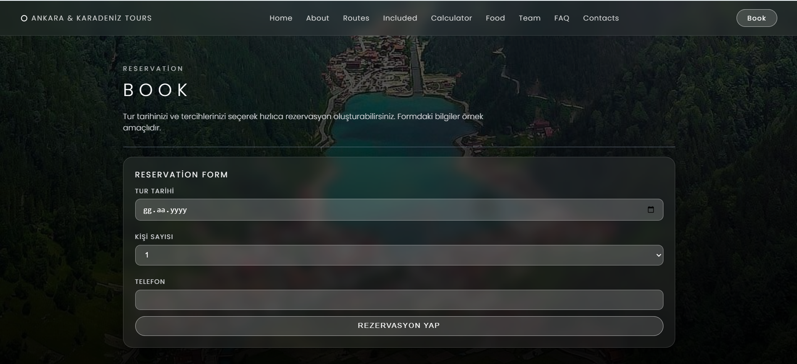
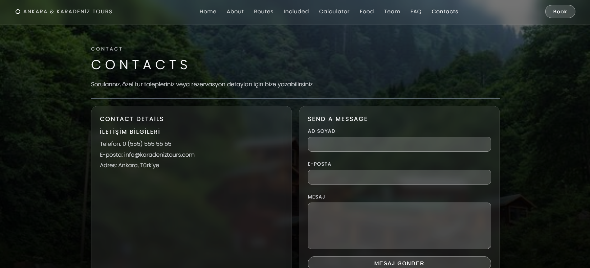
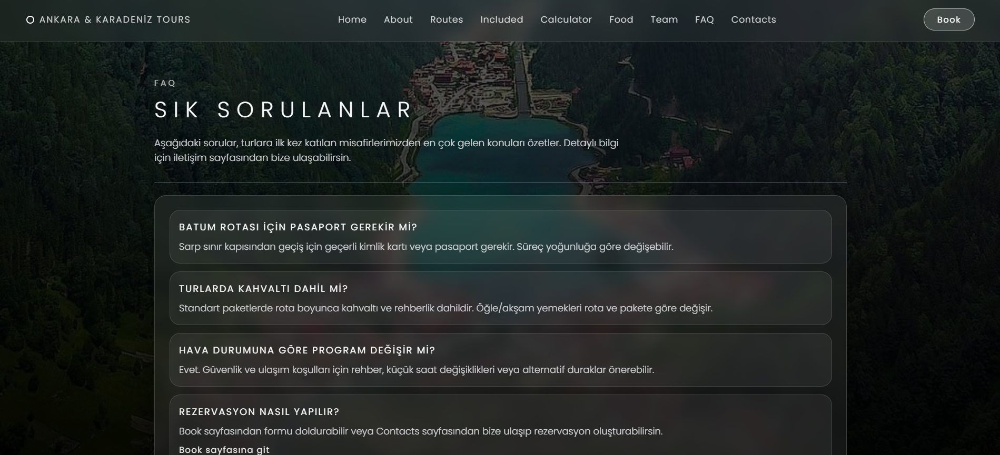
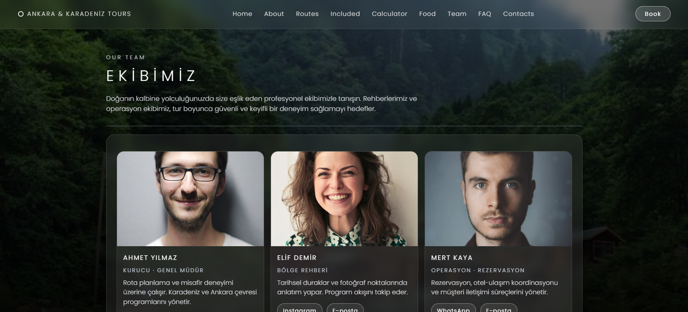
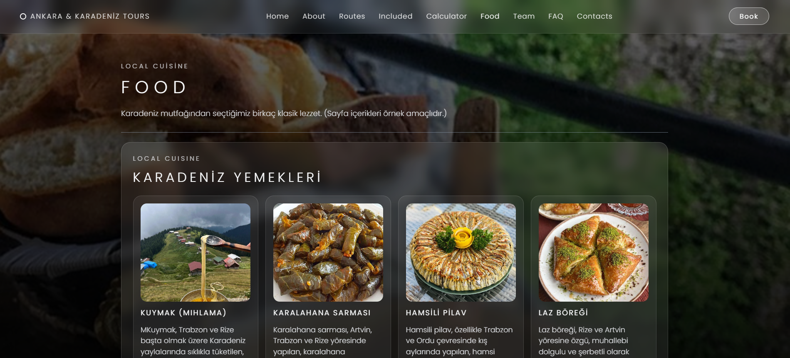
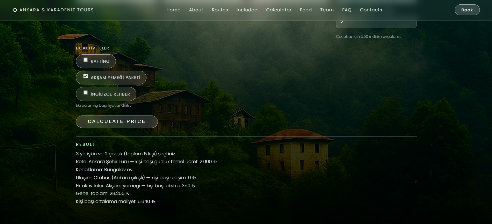
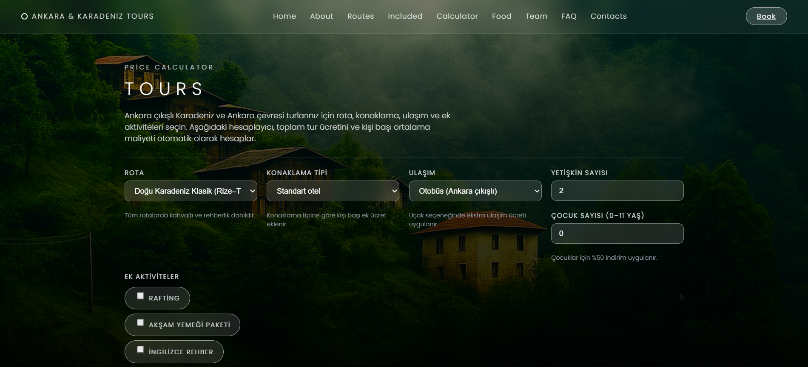
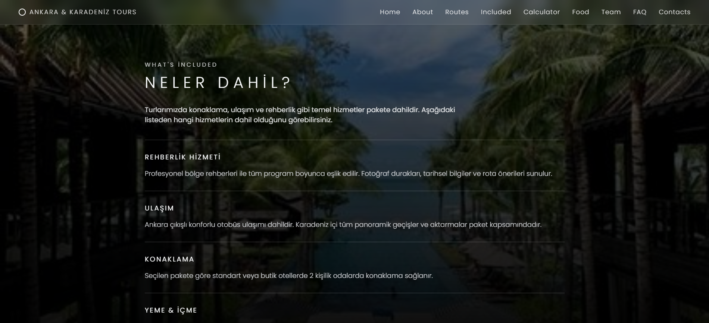
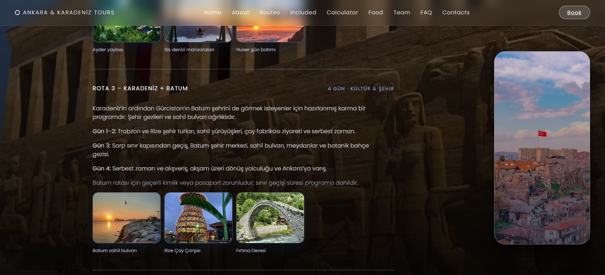
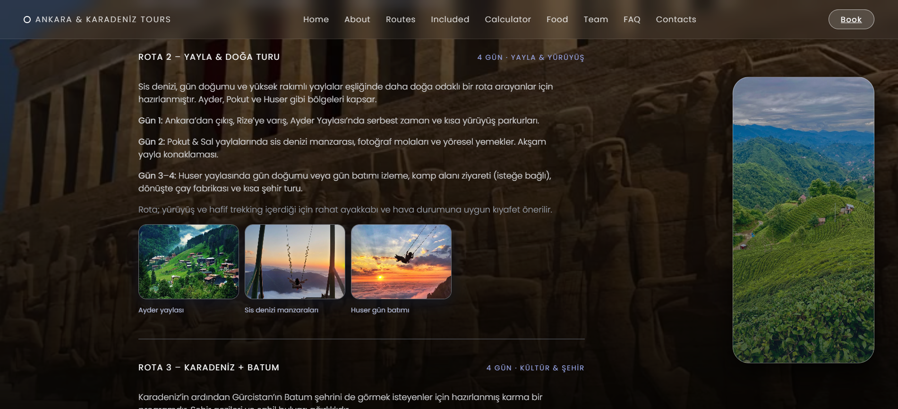
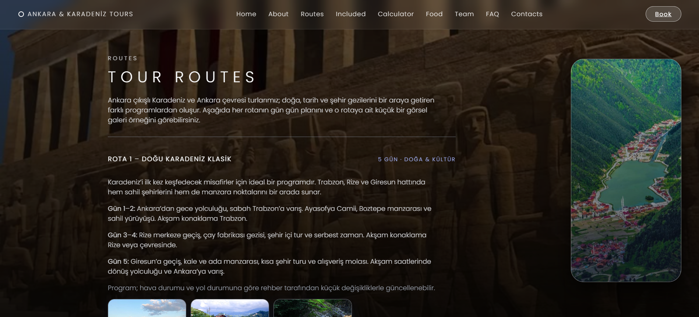
